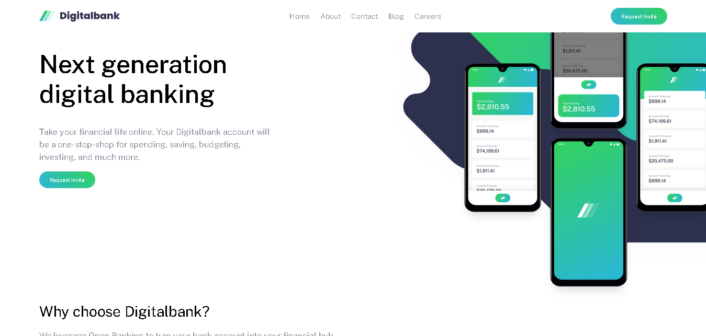

# Frontend Mentor - Digitalbank landing page solution

This is a solution to the [Digitalbank landing page challenge on Frontend Mentor](https://www.frontendmentor.io/challenges/digital-bank-landing-page-WaUhkoDN). Frontend Mentor challenges help you improve your coding skills by building realistic projects.

## Table of contents

- [Overview](#overview)
  - [The challenge](#the-challenge)
  - [Screenshot](#screenshot)
  - [Links](#links)
- [My process](#my-process)
  - [Built with](#built-with)
- [Author](#author)

## Overview

### The challenge

Users should be able to:

- View the optimal layout for the site depending on their device's screen size
- See hover states for all interactive elements on the page

### Screenshot

### Links

- Solution URL: [https://github.com/samirrhashimov/bank_landing_page](https://github.com/samirrhashimov/bank_landing_page)
- Live Site URL: [https://banklandingpage.vercel.app](https://banklandingpage.vercel.app)

## My process

### Built with

- Semantic HTML5 markup
- CSS custom properties
- Flexbox
- CSS Grid
- Mobile-first workflow

## Author
- Website - [Samir Hashimov](https://samirrhashimov.pages.dev/)
- Frontend Mentor - [@samirrhashimov](https://www.frontendmentor.io/profile/samirrhashimov)
- Twitter - [@samirrhashimov](https://www.twitter.com/samirrhashimov)